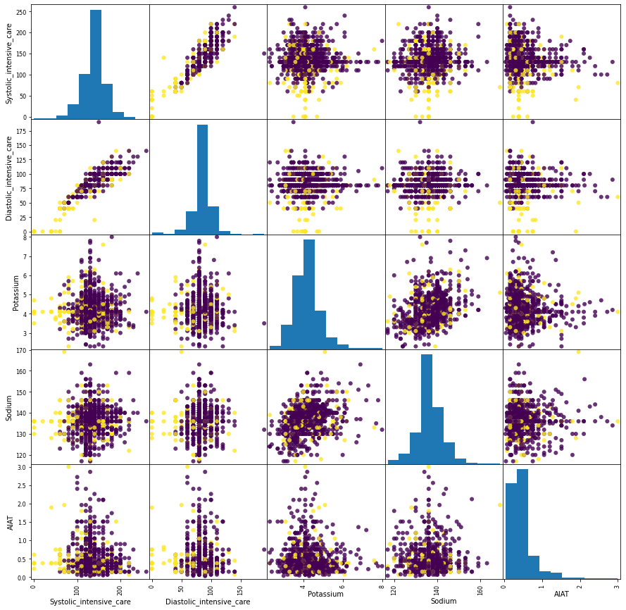

### Mycardial Infraction prediction on patients 


#### Dataset
This dataset is used to predict complications of Myocardial Infarction (MI) based on the information about the patient. The target value 0 is no complication and 1 means complication within the first three days of hospitalization. 

MI is one of the most challenging problems of modern medicine. Acute myocardial infarction is associated with high mortality in the first year after it. The incidence of MI remains high in all countries. This is especially true for the urban population of highly developed countries, which is exposed to chronic stress factors, irregular and not always balanced nutrition. In the United States, for example, more than a million people suffer from MI every year, and 200-300 thousand of them die from acute MI before arriving at the hospital.
In this regard, predicting complications of myocardial infarction in order to timely carry out the necessary preventive measures is an important task.

* Age
* Gender
* Myocardial:  Quantity of myocardial infarctions in the anamnesis – Ordinal
* Exertional angina: Exertional angina pectoris in the anamnesis
* FC: Functional class (FC) of angina pectoris in the last year – Ordinal
* Heart Disease: Coronary heart disease (CHD) in recent weeks, days before admission to hospital
* Heredity: Heredity on CHD
* Hypertension: Presence of an essential hypertension
* Symptomatic hypertension
* Duration: Duration of arterial hypertension
* Arrhythmia: Observing of arrhythmia in the anamnesis
* Systolic_emergency: Systolic blood pressure according to Emergency Cardiology Team
* Diastolic_emergency: Diastolic blood pressure according to Emergency Cardiology Team
* Systolic_intensive_care: Systolic blood pressure according to intensive care unit
* Diastolic_intensive_care: Diastolic blood pressure according to intensive care unit
* Potassium: Serum potassium content
* Sodium: Serum sodium content
* AlAT: Serum AlAT content
* AsTK: Serum AsTK content
* WBC: White Blood Cell Count
* ESR: Erythrocyte sedimentation rate
* Time: Time elapsed from the beginning of the attack of CHD to the hospital
* Outcome: target column

# Preprocessing


```python
import pandas as pd
import numpy as np
from matplotlib import pyplot as plt
```


```python
train = pd.read_csv('train.csv')
test = pd.read_csv('test.csv')
```


```python
train.info()
```

    <class 'pandas.core.frame.DataFrame'>
    RangeIndex: 1275 entries, 0 to 1274
    Data columns (total 23 columns):
     #   Column                    Non-Null Count  Dtype 
    ---  ------                    --------------  ----- 
     0   Age                       1275 non-null   object
     1   Gender                    1275 non-null   object
     2   myocardial                1275 non-null   object
     3   Exertional angina         1275 non-null   object
     4   FC                        1275 non-null   object
     5   Heart Disease             1275 non-null   object
     6   Heredity                  1275 non-null   object
     7   Hypertension              1275 non-null   object
     8   Symptomatic hypertension  1275 non-null   object
     9   Duration                  1275 non-null   object
     10  Arrhythmia                1275 non-null   object
     11  Systolic_emergency        1275 non-null   object
     12  Diastolic_emergency       1275 non-null   object
     13  Systolic_intensive_care   1275 non-null   object
     14  Diastolic_intensive_care  1275 non-null   object
     15  Potassium                 1275 non-null   object
     16  Sodium                    1275 non-null   object
     17  AlAT                      1275 non-null   object
     18  AsAT                      1275 non-null   object
     19  WBC                       1275 non-null   object
     20  ESR                       1275 non-null   object
     21  Time                      1275 non-null   object
     22  Outcome                   1275 non-null   int64 
    dtypes: int64(1), object(22)
    memory usage: 229.2+ KB


We can see that all the columns are of type object and hence we don't see any missing values here. 


```python
train.head()
```


<div>
<style scoped>
    .dataframe tbody tr th:only-of-type {
        vertical-align: middle;
    }

    .dataframe tbody tr th {
        vertical-align: top;
    }

    .dataframe thead th {
        text-align: right;
    }
</style>
<table border="1" class="dataframe">
  <thead>
    <tr style="text-align: right;">
      <th></th>
      <th>Age</th>
      <th>Gender</th>
      <th>myocardial</th>
      <th>Exertional angina</th>
      <th>FC</th>
      <th>Heart Disease</th>
      <th>Heredity</th>
      <th>Hypertension</th>
      <th>Symptomatic hypertension</th>
      <th>Duration</th>
      <th>...</th>
      <th>Systolic_intensive_care</th>
      <th>Diastolic_intensive_care</th>
      <th>Potassium</th>
      <th>Sodium</th>
      <th>AlAT</th>
      <th>AsAT</th>
      <th>WBC</th>
      <th>ESR</th>
      <th>Time</th>
      <th>Outcome</th>
    </tr>
  </thead>
  <tbody>
    <tr>
      <th>0</th>
      <td>75</td>
      <td>Female</td>
      <td>0</td>
      <td>Two years ago</td>
      <td>II FC</td>
      <td>Exertional angina</td>
      <td>?</td>
      <td>Stage 2</td>
      <td>No</td>
      <td>?</td>
      <td>...</td>
      <td>140</td>
      <td>90</td>
      <td>?</td>
      <td>?</td>
      <td>0.3</td>
      <td>0.18</td>
      <td>7.8</td>
      <td>16</td>
      <td>7</td>
      <td>0</td>
    </tr>
    <tr>
      <th>1</th>
      <td>50</td>
      <td>Male</td>
      <td>1</td>
      <td>Two years ago</td>
      <td>II FC</td>
      <td>Unstable angina</td>
      <td>?</td>
      <td>Stage 2</td>
      <td>No</td>
      <td>One year</td>
      <td>...</td>
      <td>?</td>
      <td>?</td>
      <td>3.9</td>
      <td>132</td>
      <td>0.23</td>
      <td>0.52</td>
      <td>6.2</td>
      <td>20</td>
      <td>7</td>
      <td>0</td>
    </tr>
    <tr>
      <th>2</th>
      <td>54</td>
      <td>Male</td>
      <td>0</td>
      <td>Never</td>
      <td>No angina</td>
      <td>No angina</td>
      <td>?</td>
      <td>No</td>
      <td>No</td>
      <td>No hypertension</td>
      <td>...</td>
      <td>140</td>
      <td>100</td>
      <td>?</td>
      <td>?</td>
      <td>?</td>
      <td>?</td>
      <td>6.9</td>
      <td>6</td>
      <td>?</td>
      <td>0</td>
    </tr>
    <tr>
      <th>3</th>
      <td>51</td>
      <td>Male</td>
      <td>?</td>
      <td>?</td>
      <td>?</td>
      <td>Unstable angina</td>
      <td>?</td>
      <td>?</td>
      <td>?</td>
      <td>?</td>
      <td>...</td>
      <td>0</td>
      <td>0</td>
      <td>?</td>
      <td>?</td>
      <td>?</td>
      <td>?</td>
      <td>?</td>
      <td>?</td>
      <td>2</td>
      <td>1</td>
    </tr>
    <tr>
      <th>4</th>
      <td>76</td>
      <td>Female</td>
      <td>3</td>
      <td>Never</td>
      <td>No angina</td>
      <td>Unstable angina</td>
      <td>?</td>
      <td>Stage 2</td>
      <td>No</td>
      <td>More than 10 years</td>
      <td>...</td>
      <td>110</td>
      <td>70</td>
      <td>?</td>
      <td>?</td>
      <td>0.15</td>
      <td>0.26</td>
      <td>4</td>
      <td>5</td>
      <td>7</td>
      <td>0</td>
    </tr>
  </tbody>
</table>
<p>5 rows × 23 columns</p>
</div>


From observing the top 5 rows, we see that a lot of columns have '?' in it indicating missing values. 

#### Replacing ? with NaN 

Replacing '?' across the columns as NaN


```python
for col in train.columns:
    train[col] = train[col].replace('?',np.nan) 
```

Converting numerical columns to float 


```python
train['Age'] = train['Age'].astype(float)
train['myocardial'] = train['myocardial'].astype(float)
```


```python
train[train.columns[11:22]] = train[train.columns[11:22]].astype(float)
```


```python
train.describe()
```


<div>
<style scoped>
    .dataframe tbody tr th:only-of-type {
        vertical-align: middle;
    }

    .dataframe tbody tr th {
        vertical-align: top;
    }

    .dataframe thead th {
        text-align: right;
    }
</style>
<table border="1" class="dataframe">
  <thead>
    <tr style="text-align: right;">
      <th></th>
      <th>Age</th>
      <th>myocardial</th>
      <th>Systolic_emergency</th>
      <th>Diastolic_emergency</th>
      <th>Systolic_intensive_care</th>
      <th>Diastolic_intensive_care</th>
      <th>Potassium</th>
      <th>Sodium</th>
      <th>AlAT</th>
      <th>AsAT</th>
      <th>WBC</th>
      <th>ESR</th>
      <th>Time</th>
      <th>Outcome</th>
    </tr>
  </thead>
  <tbody>
    <tr>
      <th>count</th>
      <td>1274.000000</td>
      <td>1274.00000</td>
      <td>474.000000</td>
      <td>474.000000</td>
      <td>1066.000000</td>
      <td>1066.000000</td>
      <td>993.000000</td>
      <td>992.000000</td>
      <td>1067.000000</td>
      <td>1066.000000</td>
      <td>1188.000000</td>
      <td>1132.000000</td>
      <td>1178.000000</td>
      <td>1275.000000</td>
    </tr>
    <tr>
      <th>mean</th>
      <td>64.154631</td>
      <td>0.56044</td>
      <td>137.700422</td>
      <td>82.004219</td>
      <td>134.812383</td>
      <td>83.076923</td>
      <td>4.194361</td>
      <td>136.607863</td>
      <td>0.472671</td>
      <td>0.262336</td>
      <td>8.843519</td>
      <td>13.475265</td>
      <td>4.702037</td>
      <td>0.160784</td>
    </tr>
    <tr>
      <th>std</th>
      <td>46.793076</td>
      <td>0.83419</td>
      <td>34.681988</td>
      <td>19.997145</td>
      <td>31.734114</td>
      <td>18.631784</td>
      <td>0.770440</td>
      <td>6.598662</td>
      <td>0.386188</td>
      <td>0.206220</td>
      <td>3.449176</td>
      <td>10.796416</td>
      <td>2.858370</td>
      <td>0.367476</td>
    </tr>
    <tr>
      <th>min</th>
      <td>26.000000</td>
      <td>0.00000</td>
      <td>0.000000</td>
      <td>0.000000</td>
      <td>0.000000</td>
      <td>0.000000</td>
      <td>2.300000</td>
      <td>117.000000</td>
      <td>0.030000</td>
      <td>0.040000</td>
      <td>2.000000</td>
      <td>1.000000</td>
      <td>1.000000</td>
      <td>0.000000</td>
    </tr>
    <tr>
      <th>25%</th>
      <td>54.000000</td>
      <td>0.00000</td>
      <td>120.000000</td>
      <td>70.000000</td>
      <td>120.000000</td>
      <td>80.000000</td>
      <td>3.700000</td>
      <td>133.000000</td>
      <td>0.230000</td>
      <td>0.150000</td>
      <td>6.400000</td>
      <td>5.000000</td>
      <td>2.000000</td>
      <td>0.000000</td>
    </tr>
    <tr>
      <th>50%</th>
      <td>63.000000</td>
      <td>0.00000</td>
      <td>140.000000</td>
      <td>80.000000</td>
      <td>130.000000</td>
      <td>80.000000</td>
      <td>4.100000</td>
      <td>136.000000</td>
      <td>0.380000</td>
      <td>0.220000</td>
      <td>8.100000</td>
      <td>10.000000</td>
      <td>4.000000</td>
      <td>0.000000</td>
    </tr>
    <tr>
      <th>75%</th>
      <td>70.000000</td>
      <td>1.00000</td>
      <td>160.000000</td>
      <td>90.000000</td>
      <td>150.000000</td>
      <td>90.000000</td>
      <td>4.600000</td>
      <td>140.000000</td>
      <td>0.610000</td>
      <td>0.300000</td>
      <td>10.500000</td>
      <td>19.000000</td>
      <td>7.000000</td>
      <td>0.000000</td>
    </tr>
    <tr>
      <th>max</th>
      <td>999.000000</td>
      <td>3.00000</td>
      <td>260.000000</td>
      <td>190.000000</td>
      <td>260.000000</td>
      <td>190.000000</td>
      <td>8.000000</td>
      <td>169.000000</td>
      <td>3.000000</td>
      <td>2.150000</td>
      <td>27.900000</td>
      <td>68.000000</td>
      <td>9.000000</td>
      <td>1.000000</td>
    </tr>
  </tbody>
</table>
</div>


#### Replacing 999 in the Age column as NaN


```python
train['Age'] = train['Age'].replace(999,np.nan)
```


```python
train.describe()
```


<div>
<style scoped>
    .dataframe tbody tr th:only-of-type {
        vertical-align: middle;
    }

    .dataframe tbody tr th {
        vertical-align: top;
    }

    .dataframe thead th {
        text-align: right;
    }
</style>
<table border="1" class="dataframe">
  <thead>
    <tr style="text-align: right;">
      <th></th>
      <th>Age</th>
      <th>myocardial</th>
      <th>Systolic_emergency</th>
      <th>Diastolic_emergency</th>
      <th>Systolic_intensive_care</th>
      <th>Diastolic_intensive_care</th>
      <th>Potassium</th>
      <th>Sodium</th>
      <th>AlAT</th>
      <th>AsAT</th>
      <th>WBC</th>
      <th>ESR</th>
      <th>Time</th>
      <th>Outcome</th>
    </tr>
  </thead>
  <tbody>
    <tr>
      <th>count</th>
      <td>1271.000000</td>
      <td>1274.00000</td>
      <td>474.000000</td>
      <td>474.000000</td>
      <td>1066.000000</td>
      <td>1066.000000</td>
      <td>993.000000</td>
      <td>992.000000</td>
      <td>1067.000000</td>
      <td>1066.000000</td>
      <td>1188.000000</td>
      <td>1132.000000</td>
      <td>1178.000000</td>
      <td>1275.000000</td>
    </tr>
    <tr>
      <th>mean</th>
      <td>61.948072</td>
      <td>0.56044</td>
      <td>137.700422</td>
      <td>82.004219</td>
      <td>134.812383</td>
      <td>83.076923</td>
      <td>4.194361</td>
      <td>136.607863</td>
      <td>0.472671</td>
      <td>0.262336</td>
      <td>8.843519</td>
      <td>13.475265</td>
      <td>4.702037</td>
      <td>0.160784</td>
    </tr>
    <tr>
      <th>std</th>
      <td>11.201609</td>
      <td>0.83419</td>
      <td>34.681988</td>
      <td>19.997145</td>
      <td>31.734114</td>
      <td>18.631784</td>
      <td>0.770440</td>
      <td>6.598662</td>
      <td>0.386188</td>
      <td>0.206220</td>
      <td>3.449176</td>
      <td>10.796416</td>
      <td>2.858370</td>
      <td>0.367476</td>
    </tr>
    <tr>
      <th>min</th>
      <td>26.000000</td>
      <td>0.00000</td>
      <td>0.000000</td>
      <td>0.000000</td>
      <td>0.000000</td>
      <td>0.000000</td>
      <td>2.300000</td>
      <td>117.000000</td>
      <td>0.030000</td>
      <td>0.040000</td>
      <td>2.000000</td>
      <td>1.000000</td>
      <td>1.000000</td>
      <td>0.000000</td>
    </tr>
    <tr>
      <th>25%</th>
      <td>54.000000</td>
      <td>0.00000</td>
      <td>120.000000</td>
      <td>70.000000</td>
      <td>120.000000</td>
      <td>80.000000</td>
      <td>3.700000</td>
      <td>133.000000</td>
      <td>0.230000</td>
      <td>0.150000</td>
      <td>6.400000</td>
      <td>5.000000</td>
      <td>2.000000</td>
      <td>0.000000</td>
    </tr>
    <tr>
      <th>50%</th>
      <td>63.000000</td>
      <td>0.00000</td>
      <td>140.000000</td>
      <td>80.000000</td>
      <td>130.000000</td>
      <td>80.000000</td>
      <td>4.100000</td>
      <td>136.000000</td>
      <td>0.380000</td>
      <td>0.220000</td>
      <td>8.100000</td>
      <td>10.000000</td>
      <td>4.000000</td>
      <td>0.000000</td>
    </tr>
    <tr>
      <th>75%</th>
      <td>70.000000</td>
      <td>1.00000</td>
      <td>160.000000</td>
      <td>90.000000</td>
      <td>150.000000</td>
      <td>90.000000</td>
      <td>4.600000</td>
      <td>140.000000</td>
      <td>0.610000</td>
      <td>0.300000</td>
      <td>10.500000</td>
      <td>19.000000</td>
      <td>7.000000</td>
      <td>0.000000</td>
    </tr>
    <tr>
      <th>max</th>
      <td>92.000000</td>
      <td>3.00000</td>
      <td>260.000000</td>
      <td>190.000000</td>
      <td>260.000000</td>
      <td>190.000000</td>
      <td>8.000000</td>
      <td>169.000000</td>
      <td>3.000000</td>
      <td>2.150000</td>
      <td>27.900000</td>
      <td>68.000000</td>
      <td>9.000000</td>
      <td>1.000000</td>
    </tr>
  </tbody>
</table>
</div>


```python
train.info()
```

    <class 'pandas.core.frame.DataFrame'>
    RangeIndex: 1275 entries, 0 to 1274
    Data columns (total 23 columns):
     #   Column                    Non-Null Count  Dtype  
    ---  ------                    --------------  -----  
     0   Age                       1271 non-null   float64
     1   Gender                    1275 non-null   object 
     2   myocardial                1274 non-null   float64
     3   Exertional angina         1202 non-null   object 
     4   FC                        1225 non-null   object 
     5   Heart Disease             1235 non-null   object 
     6   Heredity                  57 non-null     object 
     7   Hypertension              1271 non-null   object 
     8   Symptomatic hypertension  1272 non-null   object 
     9   Duration                  1085 non-null   object 
     10  Arrhythmia                1261 non-null   object 
     11  Systolic_emergency        474 non-null    float64
     12  Diastolic_emergency       474 non-null    float64
     13  Systolic_intensive_care   1066 non-null   float64
     14  Diastolic_intensive_care  1066 non-null   float64
     15  Potassium                 993 non-null    float64
     16  Sodium                    992 non-null    float64
     17  AlAT                      1067 non-null   float64
     18  AsAT                      1066 non-null   float64
     19  WBC                       1188 non-null   float64
     20  ESR                       1132 non-null   float64
     21  Time                      1178 non-null   float64
     22  Outcome                   1275 non-null   int64  
    dtypes: float64(13), int64(1), object(9)
    memory usage: 229.2+ KB


#### Test dataset


```python
for col in test.columns:
    test[col] = test[col].replace('?',np.nan) 

#Converting numerical columns to float 

test['Age'] = test['Age'].astype(float)
test['myocardial'] = test['myocardial'].astype(float)

test[test.columns[11:22]] = test[test.columns[11:22]].astype(float)
```


```python
test['Age'] = test['Age'].replace(999,np.nan)
```


```python
test.info()
```

    <class 'pandas.core.frame.DataFrame'>
    RangeIndex: 425 entries, 0 to 424
    Data columns (total 22 columns):
     #   Column                    Non-Null Count  Dtype  
    ---  ------                    --------------  -----  
     0   Age                       421 non-null    float64
     1   Gender                    425 non-null    object 
     2   myocardial                422 non-null    float64
     3   Exertional angina         392 non-null    object 
     4   FC                        402 non-null    object 
     5   Heart Disease             414 non-null    object 
     6   Heredity                  15 non-null     object 
     7   Hypertension              420 non-null    object 
     8   Symptomatic hypertension  420 non-null    object 
     9   Duration                  367 non-null    object 
     10  Arrhythmia                418 non-null    object 
     11  Systolic_emergency        150 non-null    float64
     12  Diastolic_emergency       150 non-null    float64
     13  Systolic_intensive_care   367 non-null    float64
     14  Diastolic_intensive_care  367 non-null    float64
     15  Potassium                 336 non-null    float64
     16  Sodium                    333 non-null    float64
     17  AlAT                      349 non-null    float64
     18  AsAT                      349 non-null    float64
     19  WBC                       387 non-null    float64
     20  ESR                       365 non-null    float64
     21  Time                      396 non-null    float64
    dtypes: float64(13), object(9)
    memory usage: 73.2+ KB


### Exploratory analysis

Observing the Missing values


```python
train.isnull().any(axis= 'columns').sum()
```


    1267


```python
train.isnull().sum()
```


    Age                            4
    Gender                         0
    myocardial                     1
    Exertional angina             73
    FC                            50
    Heart Disease                 40
    Heredity                    1218
    Hypertension                   4
    Symptomatic hypertension       3
    Duration                     190
    Arrhythmia                    14
    Systolic_emergency           801
    Diastolic_emergency          801
    Systolic_intensive_care      209
    Diastolic_intensive_care     209
    Potassium                    282
    Sodium                       283
    AlAT                         208
    AsAT                         209
    WBC                           87
    ESR                          143
    Time                          97
    Outcome                        0
    dtype: int64


#### Age


```python
train.Age.hist()
plt.title('Age histogram')
```


    Text(0.5, 1.0, 'Age histogram')


    

    


The Age histogram is approximately normally distributed with Mean ~ 62 and Median ~ 63
and will hence use Median imputation 


```python
train[['Age','Outcome']].groupby('Outcome').median()
```


<div>
<style scoped>
    .dataframe tbody tr th:only-of-type {
        vertical-align: middle;
    }

    .dataframe tbody tr th {
        vertical-align: top;
    }

    .dataframe thead th {
        text-align: right;
    }
</style>
<table border="1" class="dataframe">
  <thead>
    <tr style="text-align: right;">
      <th></th>
      <th>Age</th>
    </tr>
    <tr>
      <th>Outcome</th>
      <th></th>
    </tr>
  </thead>
  <tbody>
    <tr>
      <th>0</th>
      <td>62.0</td>
    </tr>
    <tr>
      <th>1</th>
      <td>67.0</td>
    </tr>
  </tbody>
</table>
</div>


We see that mean Age for people tested to have MI complication is greater than people who have no MI complication.


```python
train[train['Age'].isnull()]
```


<div>
<style scoped>
    .dataframe tbody tr th:only-of-type {
        vertical-align: middle;
    }

    .dataframe tbody tr th {
        vertical-align: top;
    }

    .dataframe thead th {
        text-align: right;
    }
</style>
<table border="1" class="dataframe">
  <thead>
    <tr style="text-align: right;">
      <th></th>
      <th>Age</th>
      <th>Gender</th>
      <th>myocardial</th>
      <th>Exertional angina</th>
      <th>FC</th>
      <th>Heart Disease</th>
      <th>Heredity</th>
      <th>Hypertension</th>
      <th>Symptomatic hypertension</th>
      <th>Duration</th>
      <th>...</th>
      <th>Systolic_intensive_care</th>
      <th>Diastolic_intensive_care</th>
      <th>Potassium</th>
      <th>Sodium</th>
      <th>AlAT</th>
      <th>AsAT</th>
      <th>WBC</th>
      <th>ESR</th>
      <th>Time</th>
      <th>Outcome</th>
    </tr>
  </thead>
  <tbody>
    <tr>
      <th>248</th>
      <td>NaN</td>
      <td>Male</td>
      <td>0.0</td>
      <td>Two years ago</td>
      <td>II FC</td>
      <td>Unstable angina</td>
      <td>NaN</td>
      <td>Stage 2</td>
      <td>No</td>
      <td>More than 10 years</td>
      <td>...</td>
      <td>NaN</td>
      <td>NaN</td>
      <td>4.7</td>
      <td>142.0</td>
      <td>0.30</td>
      <td>0.07</td>
      <td>10.3</td>
      <td>17.0</td>
      <td>6.0</td>
      <td>0</td>
    </tr>
    <tr>
      <th>295</th>
      <td>NaN</td>
      <td>Male</td>
      <td>0.0</td>
      <td>Two years ago</td>
      <td>II FC</td>
      <td>Unstable angina</td>
      <td>NaN</td>
      <td>No</td>
      <td>No</td>
      <td>No hypertension</td>
      <td>...</td>
      <td>NaN</td>
      <td>NaN</td>
      <td>3.9</td>
      <td>131.0</td>
      <td>0.45</td>
      <td>0.30</td>
      <td>12.7</td>
      <td>9.0</td>
      <td>3.0</td>
      <td>0</td>
    </tr>
    <tr>
      <th>547</th>
      <td>NaN</td>
      <td>Female</td>
      <td>2.0</td>
      <td>More than five years ago</td>
      <td>II FC</td>
      <td>Exertional angina</td>
      <td>NaN</td>
      <td>Stage 2</td>
      <td>No</td>
      <td>Six to ten years</td>
      <td>...</td>
      <td>100.0</td>
      <td>60.0</td>
      <td>4.6</td>
      <td>132.0</td>
      <td>0.75</td>
      <td>0.22</td>
      <td>5.6</td>
      <td>14.0</td>
      <td>3.0</td>
      <td>0</td>
    </tr>
    <tr>
      <th>729</th>
      <td>NaN</td>
      <td>Male</td>
      <td>0.0</td>
      <td>Never</td>
      <td>No angina</td>
      <td>No angina</td>
      <td>NaN</td>
      <td>No</td>
      <td>No</td>
      <td>No hypertension</td>
      <td>...</td>
      <td>140.0</td>
      <td>90.0</td>
      <td>NaN</td>
      <td>NaN</td>
      <td>NaN</td>
      <td>NaN</td>
      <td>15.5</td>
      <td>10.0</td>
      <td>8.0</td>
      <td>0</td>
    </tr>
  </tbody>
</table>
<p>4 rows × 23 columns</p>
</div>


```python
train[['Age','Gender']].groupby('Gender').median()
```


<div>
<style scoped>
    .dataframe tbody tr th:only-of-type {
        vertical-align: middle;
    }

    .dataframe tbody tr th {
        vertical-align: top;
    }

    .dataframe thead th {
        text-align: right;
    }
</style>
<table border="1" class="dataframe">
  <thead>
    <tr style="text-align: right;">
      <th></th>
      <th>Age</th>
    </tr>
    <tr>
      <th>Gender</th>
      <th></th>
    </tr>
  </thead>
  <tbody>
    <tr>
      <th>Female</th>
      <td>68.0</td>
    </tr>
    <tr>
      <th>Male</th>
      <td>59.0</td>
    </tr>
  </tbody>
</table>
</div>


Median age in the dataset for Female is 68 and Male is 59.

Age imputation will be done maintaining this distribution


```python
train['Age'] = train['Age'].fillna(train.groupby('Gender')['Age'].transform('median'))
```


```python
test['Age'] = test['Age'].fillna(train.groupby('Gender')['Age'].transform('median'))
```

#### Gender


```python
train.Gender.value_counts().plot(kind = 'bar', title = 'Gender counts')
```


    <AxesSubplot:title={'center':'Gender counts'}>


    

    


We can see that there are more Male than Female in the dataset.
Mapping Male to 1 and Female to 0


```python
train['Gender']=train['Gender'].map({'Female':0,'Male':1}).astype(int)
```


```python
test['Gender']=test['Gender'].map({'Female':0,'Male':1}).astype(int)
```

#### Myocardial - ordinal 


```python
train['myocardial'].value_counts().plot(kind = 'bar', title = 'Myocardial counts')
```


    <AxesSubplot:title={'center':'Myocardial counts'}>


    

    


We see that 0 is the dominant value

Examining Heart Disease and Myocardial value to check if it has a variation.


```python
train[['Heart Disease','myocardial']].groupby('Heart Disease').agg(pd.Series.mode)
```


<div>
<style scoped>
    .dataframe tbody tr th:only-of-type {
        vertical-align: middle;
    }

    .dataframe tbody tr th {
        vertical-align: top;
    }

    .dataframe thead th {
        text-align: right;
    }
</style>
<table border="1" class="dataframe">
  <thead>
    <tr style="text-align: right;">
      <th></th>
      <th>myocardial</th>
    </tr>
    <tr>
      <th>Heart Disease</th>
      <th></th>
    </tr>
  </thead>
  <tbody>
    <tr>
      <th>Exertional angina</th>
      <td>0.0</td>
    </tr>
    <tr>
      <th>No angina</th>
      <td>0.0</td>
    </tr>
    <tr>
      <th>Unstable angina</th>
      <td>0.0</td>
    </tr>
  </tbody>
</table>
</div>


We don't see a difference and is hence not useful.

Imputing mode = 0 to the missing value


```python
train['myocardial'] = train['myocardial'].fillna(0).astype(int)
```


```python
test['myocardial'] = test['myocardial'] .fillna(0).astype(int)
```

#### Exertional Angina


```python
train['Exertional angina'].value_counts()
```


    Never                       504
    More than five years ago    254
    During the last year        105
    One year ago                103
    Two years ago                92
    Four to five years ago       91
    Three years ago              53
    Name: Exertional angina, dtype: int64


```python
train['Exertional angina'].value_counts().plot(kind = 'bar', title = 'Exertional Angina counts')
```


    <AxesSubplot:title={'center':'Exertional Angina counts'}>


    

    


```python
#mode imputation and one-hot vector encoding - train data
train['Exertional angina'].replace(np.NaN, 'Never', inplace = True)
```


```python
cols = pd.get_dummies(train['Exertional angina'], prefix = 'Exertionalangina')
train[cols.columns] = cols
train.drop('Exertional angina', axis = 1, inplace = True)
```


```python
#mode imputation and one-hot vector encoding - test data
test['Exertional angina'].replace(np.NaN, 'Never', inplace = True)
```


```python
cols = pd.get_dummies(test['Exertional angina'],prefix = 'Exertionalangina')
test[cols.columns] = cols
test.drop('Exertional angina', axis = 1, inplace = True)
```

#### Functional Class - ordinal


```python
train['FC'].value_counts()
```


    II FC        639
    No angina    503
    III FC        38
    I FC          37
    IV FC          8
    Name: FC, dtype: int64


```python
train['FC'].value_counts().plot(kind = 'bar', title = 'Functional class count')
```


    <AxesSubplot:title={'center':'Functional class count'}>


    

    


Replacing NaN with most frequent value and mapping the categorical value to numerical,thereby making it ordinal


```python
train['FC'].replace(np.NaN, 'II FC', inplace = True)
```


```python
train['FC'] = train['FC'].map({'No angina':0,
                              'I FC':1,
                              'II FC':2,
                              'III FC':3,
                              'IV FC':4 }).astype(int)
```


```python
test['FC'].replace(np.NaN, 'II FC', inplace = True)
```


```python
test['FC'] = test['FC'].map({'No angina':0,
                              'I FC':1,
                              'II FC':2,
                              'III FC':3,
                              'IV FC':4 }).astype(int)
```

#### Heart Disease


```python
train['Heart Disease'].value_counts().plot(kind = 'bar', title = 'Heart Disease counts' )
```


    <AxesSubplot:title={'center':'Heart Disease counts'}>


    

    


Replacing NaN with most common category and one-hot encoding the column


```python
train['Heart Disease'].fillna('Unstable angina', inplace = True)
```


```python
cols = pd.get_dummies(train['Heart Disease'], prefix = 'HeartDisease')
train[cols.columns] = cols
train.drop('Heart Disease', axis = 1, inplace = True)
```


```python
test['Heart Disease'].fillna('Unstable angina', inplace = True)
```


```python
cols = pd.get_dummies(test['Heart Disease'], prefix = 'HeartDisease')
test[cols.columns] = cols
test.drop('Heart Disease', axis = 1, inplace = True)
```

#### Hypertension


```python
train['Hypertension'].unique()
```


    array(['Stage 2', 'No', nan, 'Stage 3', 'Stage 1'], dtype=object)


```python
train['Hypertension'].value_counts()
```


    Stage 2    670
    No         445
    Stage 3    148
    Stage 1      8
    Name: Hypertension, dtype: int64


```python
train['Hypertension'].fillna('Stage 2', inplace = True)
```


```python
cols = pd.get_dummies(train['Hypertension'], prefix = 'Hypertension')
train[cols.columns] = cols
train.drop('Hypertension', axis = 1, inplace = True)
```


```python
test['Hypertension'].fillna('Stage 2', inplace = True)
```


```python
cols = pd.get_dummies(test['Hypertension'],prefix = 'Hypertension')
test[cols.columns] = cols
test.drop('Hypertension', axis = 1, inplace = True)
```

#### Symptomatic hypertension


```python
train['Symptomatic hypertension'].unique()
```


    array(['No', nan, 'Yes'], dtype=object)


```python
train['Symptomatic hypertension'].value_counts().plot(kind = 'bar', title = 'Symptomatic Hypertension count')
```


    <AxesSubplot:title={'center':'Symptomatic Hypertension count'}>


    

    


Most of the values are No. Replacing NA's with 'No' and encoding most frequent value 'No' as 1 and 'Yes' as 0


```python
train['Symptomatic hypertension'].fillna('No', inplace = True)
```


```python
train['Symptomatic hypertension'] = train['Symptomatic hypertension'].map({'No':1,'Yes':0})
```


```python
test['Symptomatic hypertension'].fillna('No', inplace = True)
```


```python
test['Symptomatic hypertension'] = test['Symptomatic hypertension'].map({'No':1,'Yes':0})
```


```python
test['Symptomatic hypertension'].value_counts()
```


    1    417
    0      8
    Name: Symptomatic hypertension, dtype: int64


#### Duration


```python
train['Duration'].unique()
```


    array([nan, 'One year', 'No hypertension', 'More than 10 years',
           'Six to ten years', 'Three years', 'Five years', 'Four years',
           'Two years'], dtype=object)


```python
train['Duration'].value_counts().plot(kind = 'bar', title = 'Duration counts')
```


    <AxesSubplot:title={'center':'Duration counts'}>


    

    


Replacing NAs with 'No hypertension' and one-hot encoding the column


```python
train['Duration'].fillna('No hypertension', inplace = True)
```


```python
cols = pd.get_dummies(train['Duration'],prefix = 'Duration')
train[cols.columns] = cols
train.drop('Duration', axis = 1, inplace = True)
```


```python
test['Duration'].fillna('No hypertension', inplace = True)
```


```python
cols = pd.get_dummies(test['Duration'],prefix = 'Duration')
test[cols.columns] = cols
test.drop('Duration', axis = 1, inplace = True)
```

#### Arrhythmia


```python
train['Arrhythmia'].unique()
```


    array(['No', nan, 'Yes'], dtype=object)


```python
train['Arrhythmia'].value_counts().plot(kind = 'bar', title = 'Arrhythmia counts')
```


    <AxesSubplot:title={'center':'Arrhythmia counts'}>


    

    


Replacing NAs with 'No' and mapping 'No' to 1 and 'Yes' to 0


```python
train['Arrhythmia'].fillna('No', inplace = True) 
```


```python
train['Arrhythmia']= train['Arrhythmia'].map({'No':1,'Yes':0})
```


```python
test['Arrhythmia'].fillna('No', inplace = True) 
```


```python
test['Arrhythmia']= test['Arrhythmia'].map({'No':1,'Yes':0})
```

#### Systolic intensive care


```python
train['Systolic_intensive_care'].describe()
```


    count    1066.000000
    mean      134.812383
    std        31.734114
    min         0.000000
    25%       120.000000
    50%       130.000000
    75%       150.000000
    max       260.000000
    Name: Systolic_intensive_care, dtype: float64


```python
train['Systolic_intensive_care'].hist()
```


    <AxesSubplot:>


    

    


Replacing NAs with Median


```python
train['Systolic_intensive_care'].fillna(train['Systolic_intensive_care'].median(), inplace = True)
```


```python
test['Systolic_intensive_care'].fillna(train['Systolic_intensive_care'].median(), inplace = True)
```

#### Diastolic intensive care


```python
train['Diastolic_intensive_care'].describe()
```


    count    1066.000000
    mean       83.076923
    std        18.631784
    min         0.000000
    25%        80.000000
    50%        80.000000
    75%        90.000000
    max       190.000000
    Name: Diastolic_intensive_care, dtype: float64


```python
train['Diastolic_intensive_care'].hist()
```


    <AxesSubplot:>


    

    


Replacing NAs with median


```python
train['Diastolic_intensive_care'].fillna(train['Diastolic_intensive_care'].median(), inplace = True)
```


```python
test['Diastolic_intensive_care'].fillna(train['Diastolic_intensive_care'].median(), inplace = True)
```

#### Potassium


```python
train['Potassium'].describe()
```


    count    993.000000
    mean       4.194361
    std        0.770440
    min        2.300000
    25%        3.700000
    50%        4.100000
    75%        4.600000
    max        8.000000
    Name: Potassium, dtype: float64


```python
train['Potassium'].hist()
```


    <AxesSubplot:>


    

    


```python
train['Potassium'].fillna(train['Potassium'].median(), inplace = True)
```


```python
test['Potassium'].fillna(train['Potassium'].median(), inplace = True)
```

#### Sodium 


```python
train['Sodium'].describe()
```


    count    992.000000
    mean     136.607863
    std        6.598662
    min      117.000000
    25%      133.000000
    50%      136.000000
    75%      140.000000
    max      169.000000
    Name: Sodium, dtype: float64


```python
train['Sodium'].hist()
```


    <AxesSubplot:>


    

    


```python
train['Sodium'].fillna(train['Sodium'].median(), inplace = True)
```


```python
test['Sodium'].fillna(train['Sodium'].median(), inplace = True)
```

#### AlAT


```python
train['AlAT'].describe()
```


    count    1067.000000
    mean        0.472671
    std         0.386188
    min         0.030000
    25%         0.230000
    50%         0.380000
    75%         0.610000
    max         3.000000
    Name: AlAT, dtype: float64


```python
train['AlAT'].hist()
```


    <AxesSubplot:>


    

    


```python
train['AlAT'].fillna(train['AlAT'].median(), inplace = True)
```


```python
test['AlAT'].fillna(train['AlAT'].median(), inplace = True)
```

#### AsTK


```python
train['AsAT'].describe()
```


    count    1066.000000
    mean        0.262336
    std         0.206220
    min         0.040000
    25%         0.150000
    50%         0.220000
    75%         0.300000
    max         2.150000
    Name: AsAT, dtype: float64


```python
train['AsAT'].hist()
```


    <AxesSubplot:>


    

    


```python
train['AsAT'].fillna(train['AsAT'].median(), inplace = True)
```


```python
test['AsAT'].fillna(train['AsAT'].median(), inplace = True)
```

#### WBC


```python
train['WBC'].describe()
```


    count    1188.000000
    mean        8.843519
    std         3.449176
    min         2.000000
    25%         6.400000
    50%         8.100000
    75%        10.500000
    max        27.900000
    Name: WBC, dtype: float64


```python
train['WBC'].hist()
```


    <AxesSubplot:>


    

    


```python
train['WBC'].fillna(train['WBC'].median(), inplace = True)
```


```python
test['WBC'].fillna(train['WBC'].median(), inplace = True)
```

#### ESR


```python
train['ESR'].describe()
```


    count    1132.000000
    mean       13.475265
    std        10.796416
    min         1.000000
    25%         5.000000
    50%        10.000000
    75%        19.000000
    max        68.000000
    Name: ESR, dtype: float64


```python
train['ESR'].hist()
```


    <AxesSubplot:>


    

    


```python
train['ESR'].fillna(train['ESR'].median(), inplace = True)
```


```python
test['ESR'].fillna(train['ESR'].median(), inplace = True)
```

#### Time


```python
train['Time'].describe()
```


    count    1178.000000
    mean        4.702037
    std         2.858370
    min         1.000000
    25%         2.000000
    50%         4.000000
    75%         7.000000
    max         9.000000
    Name: Time, dtype: float64


```python
train['Time'].hist()
```


    <AxesSubplot:>


    

    


```python
train['Time'].fillna(train['Time'].median(), inplace = True)
```


```python
test['Time'].fillna(train['Time'].median(), inplace = True)
```

#### Outcome


```python
train['Outcome'].value_counts().plot(kind = 'bar', title = 'Outcome Counts')
```


    <AxesSubplot:title={'center':'Outcome Counts'}>


    

    


We see that the value 0 is dominant, i.e., there are more 0's than 1's and the data is an unbalanced dataset

#### Dropping other columns having more than 60% missing values

#### Heredity


```python

train.drop('Heredity', axis = 1, inplace = True)

test.drop('Heredity', axis = 1, inplace = True)
```

#### Systolic emergency


```python
train.drop('Systolic_emergency', axis = 1, inplace = True)
```


```python
test.drop('Systolic_emergency', axis = 1, inplace = True)
```

#### Diastolic emergency


```python
train.drop('Diastolic_emergency', axis = 1, inplace = True)
```


```python
test.drop('Diastolic_emergency', axis = 1, inplace = True)
```

### Final test dataset with no missing values


```python
test.info()
```

    <class 'pandas.core.frame.DataFrame'>
    RangeIndex: 425 entries, 0 to 424
    Data columns (total 37 columns):
     #   Column                                     Non-Null Count  Dtype  
    ---  ------                                     --------------  -----  
     0   Age                                        425 non-null    float64
     1   Gender                                     425 non-null    int64  
     2   myocardial                                 425 non-null    int64  
     3   FC                                         425 non-null    int64  
     4   Symptomatic hypertension                   425 non-null    int64  
     5   Arrhythmia                                 425 non-null    int64  
     6   Systolic_intensive_care                    425 non-null    float64
     7   Diastolic_intensive_care                   425 non-null    float64
     8   Potassium                                  425 non-null    float64
     9   Sodium                                     425 non-null    float64
     10  AlAT                                       425 non-null    float64
     11  AsAT                                       425 non-null    float64
     12  WBC                                        425 non-null    float64
     13  ESR                                        425 non-null    float64
     14  Time                                       425 non-null    float64
     15  Exertionalangina_During the last year      425 non-null    uint8  
     16  Exertionalangina_Four to five years ago    425 non-null    uint8  
     17  Exertionalangina_More than five years ago  425 non-null    uint8  
     18  Exertionalangina_Never                     425 non-null    uint8  
     19  Exertionalangina_One year ago              425 non-null    uint8  
     20  Exertionalangina_Three years ago           425 non-null    uint8  
     21  Exertionalangina_Two years ago             425 non-null    uint8  
     22  HeartDisease_Exertional angina             425 non-null    uint8  
     23  HeartDisease_No angina                     425 non-null    uint8  
     24  HeartDisease_Unstable angina               425 non-null    uint8  
     25  Hypertension_No                            425 non-null    uint8  
     26  Hypertension_Stage 1                       425 non-null    uint8  
     27  Hypertension_Stage 2                       425 non-null    uint8  
     28  Hypertension_Stage 3                       425 non-null    uint8  
     29  Duration_Five years                        425 non-null    uint8  
     30  Duration_Four years                        425 non-null    uint8  
     31  Duration_More than 10 years                425 non-null    uint8  
     32  Duration_No hypertension                   425 non-null    uint8  
     33  Duration_One year                          425 non-null    uint8  
     34  Duration_Six to ten years                  425 non-null    uint8  
     35  Duration_Three years                       425 non-null    uint8  
     36  Duration_Two years                         425 non-null    uint8  
    dtypes: float64(10), int64(5), uint8(22)
    memory usage: 59.1 KB


### Final train dataset with no missing values


```python
train.info()
```

    <class 'pandas.core.frame.DataFrame'>
    RangeIndex: 1275 entries, 0 to 1274
    Data columns (total 38 columns):
     #   Column                                     Non-Null Count  Dtype  
    ---  ------                                     --------------  -----  
     0   Age                                        1275 non-null   float64
     1   Gender                                     1275 non-null   int64  
     2   myocardial                                 1275 non-null   int64  
     3   FC                                         1275 non-null   int64  
     4   Symptomatic hypertension                   1275 non-null   int64  
     5   Arrhythmia                                 1275 non-null   int64  
     6   Systolic_intensive_care                    1275 non-null   float64
     7   Diastolic_intensive_care                   1275 non-null   float64
     8   Potassium                                  1275 non-null   float64
     9   Sodium                                     1275 non-null   float64
     10  AlAT                                       1275 non-null   float64
     11  AsAT                                       1275 non-null   float64
     12  WBC                                        1275 non-null   float64
     13  ESR                                        1275 non-null   float64
     14  Time                                       1275 non-null   float64
     15  Outcome                                    1275 non-null   int64  
     16  Exertionalangina_During the last year      1275 non-null   uint8  
     17  Exertionalangina_Four to five years ago    1275 non-null   uint8  
     18  Exertionalangina_More than five years ago  1275 non-null   uint8  
     19  Exertionalangina_Never                     1275 non-null   uint8  
     20  Exertionalangina_One year ago              1275 non-null   uint8  
     21  Exertionalangina_Three years ago           1275 non-null   uint8  
     22  Exertionalangina_Two years ago             1275 non-null   uint8  
     23  HeartDisease_Exertional angina             1275 non-null   uint8  
     24  HeartDisease_No angina                     1275 non-null   uint8  
     25  HeartDisease_Unstable angina               1275 non-null   uint8  
     26  Hypertension_No                            1275 non-null   uint8  
     27  Hypertension_Stage 1                       1275 non-null   uint8  
     28  Hypertension_Stage 2                       1275 non-null   uint8  
     29  Hypertension_Stage 3                       1275 non-null   uint8  
     30  Duration_Five years                        1275 non-null   uint8  
     31  Duration_Four years                        1275 non-null   uint8  
     32  Duration_More than 10 years                1275 non-null   uint8  
     33  Duration_No hypertension                   1275 non-null   uint8  
     34  Duration_One year                          1275 non-null   uint8  
     35  Duration_Six to ten years                  1275 non-null   uint8  
     36  Duration_Three years                       1275 non-null   uint8  
     37  Duration_Two years                         1275 non-null   uint8  
    dtypes: float64(10), int64(6), uint8(22)
    memory usage: 186.9 KB


```python
#Visualizing few columns

from pandas.plotting import scatter_matrix
X = train.drop('Outcome', axis = 1)
y = train['Outcome']

attributes = X.columns[6:11]
scatter_matrix(X[attributes], figsize = (15,15), c = y, alpha = 0.8, marker = 'O')
```


    array([[<AxesSubplot:xlabel='Systolic_intensive_care', ylabel='Systolic_intensive_care'>,
            <AxesSubplot:xlabel='Diastolic_intensive_care', ylabel='Systolic_intensive_care'>,
            <AxesSubplot:xlabel='Potassium', ylabel='Systolic_intensive_care'>,
            <AxesSubplot:xlabel='Sodium', ylabel='Systolic_intensive_care'>,
            <AxesSubplot:xlabel='AlAT', ylabel='Systolic_intensive_care'>],
           [<AxesSubplot:xlabel='Systolic_intensive_care', ylabel='Diastolic_intensive_care'>,
            <AxesSubplot:xlabel='Diastolic_intensive_care', ylabel='Diastolic_intensive_care'>,
            <AxesSubplot:xlabel='Potassium', ylabel='Diastolic_intensive_care'>,
            <AxesSubplot:xlabel='Sodium', ylabel='Diastolic_intensive_care'>,
            <AxesSubplot:xlabel='AlAT', ylabel='Diastolic_intensive_care'>],
           [<AxesSubplot:xlabel='Systolic_intensive_care', ylabel='Potassium'>,
            <AxesSubplot:xlabel='Diastolic_intensive_care', ylabel='Potassium'>,
            <AxesSubplot:xlabel='Potassium', ylabel='Potassium'>,
            <AxesSubplot:xlabel='Sodium', ylabel='Potassium'>,
            <AxesSubplot:xlabel='AlAT', ylabel='Potassium'>],
           [<AxesSubplot:xlabel='Systolic_intensive_care', ylabel='Sodium'>,
            <AxesSubplot:xlabel='Diastolic_intensive_care', ylabel='Sodium'>,
            <AxesSubplot:xlabel='Potassium', ylabel='Sodium'>,
            <AxesSubplot:xlabel='Sodium', ylabel='Sodium'>,
            <AxesSubplot:xlabel='AlAT', ylabel='Sodium'>],
           [<AxesSubplot:xlabel='Systolic_intensive_care', ylabel='AlAT'>,
            <AxesSubplot:xlabel='Diastolic_intensive_care', ylabel='AlAT'>,
            <AxesSubplot:xlabel='Potassium', ylabel='AlAT'>,
            <AxesSubplot:xlabel='Sodium', ylabel='AlAT'>,
            <AxesSubplot:xlabel='AlAT', ylabel='AlAT'>]], dtype=object)


    

    


# Machine learning models

Since the dataset is unbalanced with the Outcome variable having less 1's and more 0's, accuracy will not be a good predictor. 

Recall oriented scoring such as F1 or ROC AUC will be needed.

ROC AUC scoring will be used for model evaluation.


```python
X = train.drop('Outcome', axis = 1)
y = train['Outcome']
```


```python
from sklearn.model_selection import train_test_split
from sklearn.preprocessing import MinMaxScaler

X_train_org, X_val_org, y_train, y_val = train_test_split(X,y, random_state = 0)
```


```python
#Scaling the dataset using MinMax Scaler

scaler = MinMaxScaler()
colnames = X.columns
X_train = scaler.fit_transform(X_train_org)
X_val = scaler.transform(X_val_org)
test_data = scaler.transform(test)
```

### KNN Classifier


```python
from sklearn.model_selection import GridSearchCV
from sklearn.neighbors import KNeighborsClassifier


param_grid = { 'n_neighbors' : range(1,20) }

knn = KNeighborsClassifier()
grid_search = GridSearchCV(knn, param_grid, cv = 5, scoring = 'roc_auc').fit(X_train,y_train)
```


```python
print('Cross validation score : ',grid_search.best_score_)
print('Best parameters : ',grid_search.best_params_)
```

    Cross validation score :  0.6725050403225807
    Best parameters :  {'n_neighbors': 14}


### Logistic 


```python
from sklearn.linear_model import LogisticRegression
from sklearn.model_selection import GridSearchCV

param_grid1 = { 'C' : [0.01,0.1,1,10,100],
              'max_iter' : [100,250,500]}

logit = LogisticRegression(solver = 'lbfgs',random_state = 0)
grid_log = GridSearchCV(logit, param_grid1, cv = 5, scoring = 'roc_auc', n_jobs = -1).fit(X_train,y_train)

```


```python
print('Best parameters',grid_log.best_params_)
print('Best ROC_AUC score', grid_log.best_score_)
```

    Best parameters {'C': 1, 'max_iter': 100}
    Best ROC_AUC score 0.7442716733870969


### Support Vector Classifier


```python
from sklearn.svm import SVC

param_grid3 = {'C': [0.01, 0.1, 1, 10, 100],
              'gamma': [0.01, 0.1, 1, 10, 100]}

rbf = SVC(kernel = 'rbf', random_state = 0)

grid_rbf = GridSearchCV(rbf, param_grid3,cv =5, n_jobs = -1, scoring = 'roc_auc').fit(X_train,y_train)

```


```python
print('Best parameters:', grid_rbf.best_params_)
print('Best AUC ROC score : ', grid_rbf.best_score_)
```

    Best parameters: {'C': 1, 'gamma': 0.1}
    Best AUC ROC score :  0.7363193044354839


### Decision Tree Classifier


```python
from sklearn.tree import DecisionTreeClassifier

param_grid4 = {'max_depth': [2,3,4,5,6,7,8,9,10,11] }

tree = DecisionTreeClassifier(random_state = 0)

grid_tree = GridSearchCV(tree, param_grid4,cv =5, n_jobs = -1, scoring = 'roc_auc').fit(X_train,y_train)
```


```python
print('Best parameters:', grid_tree.best_params_)
print('Best AUC ROC score : ', grid_tree.best_score_)
```

    Best parameters: {'max_depth': 5}
    Best AUC ROC score :  0.696522177419355


### Bagging Classifier


```python
from sklearn.model_selection import GridSearchCV
from sklearn.ensemble import BaggingClassifier
from sklearn.linear_model import LogisticRegression

param_grid = {'max_samples':[0.01, 0.05, 0.1,0.5,1], 
              'max_features':[0.01, 0.05, 0.1,0.5,1],
             'bootstrap' : [True, False]}

log = LogisticRegression(C = 1, max_iter = 100,penalty = 'l2', solver = 'lbfgs', random_state = 0)
bg = BaggingClassifier(log, random_state = 0)
grid_bg = GridSearchCV(bg, param_grid = param_grid, cv = 5,scoring='roc_auc', n_jobs = -1).fit(X_train,y_train)
```


```python
print('Best parameters:', grid_bg.best_params_)
print('Best AUC ROC score : ', grid_bg.best_score_)
```

    Best parameters: {'bootstrap': False, 'max_features': 0.1, 'max_samples': 0.5}
    Best AUC ROC score :  0.7519468245967742


### Gradient Boosting Classifier 


```python
from sklearn.ensemble import GradientBoostingClassifier

param_grid2 = {'learning_rate':[0.001, 0.01, 0.1,0.5],
              'n_estimators':[100,200, 500, 1000],
              'max_depth' : [2,3,4,5]}

gbrt = GradientBoostingClassifier(random_state=0)
grid_gb = GridSearchCV(gbrt, param_grid2 ,cv = 5, scoring = 'roc_auc', n_jobs = -1).fit(X_train,y_train)
```


```python
print('Best parameters:', grid_gb.best_params_)
print('Best AUC ROC score : ', grid_gb.best_score_)
```

    Best parameters: {'learning_rate': 0.01, 'max_depth': 2, 'n_estimators': 500}
    Best AUC ROC score :  0.7859929435483871


# Best model

#### Out of the above models, Gradient Boosting Classifier produces the best cross validation ROC AUC score of 0.786 and is hence the best model. 


```python
gbrt = GradientBoostingClassifier(learning_rate = 0.01, max_depth = 2, 
                                  n_estimators = 500,random_state=0)
gbrt.fit(X_train, y_train)
```


    GradientBoostingClassifier(learning_rate=0.01, max_depth=2, n_estimators=500,
                               random_state=0)


```python
from sklearn.metrics import roc_auc_score
print('Train ROC AUC score : ', roc_auc_score(y_train, gbrt.predict(X_train)))
print('Validation ROC AUC score : ', roc_auc_score(y_val, gbrt.predict(X_val)))
```

    Train ROC AUC score :  0.6147596153846154
    Validation ROC AUC score :  0.6577097505668934


#### ROC AUC visualization

Train data ROC AUC curve


```python
from sklearn import metrics

y_train_pred = gbrt.predict_proba(X_train)[:,1]

fpr, tpr, threshold = metrics.roc_curve(y_train, y_train_pred,pos_label=1)
roc_auc = metrics.auc(fpr, tpr)
```


```python
plt.figure()
plt.plot(fpr, tpr, label='Gradient Boosting Classification (area = %0.4f)' % roc_auc)
plt.xlim([0.0, 1.0])
plt.ylim([0.0, 1.05])
close_zero = np.argmin(np.abs(threshold))
plt.plot(fpr[close_zero], tpr[close_zero], 'o', markersize=10,
         label="threshold default", fillstyle="none", c='k', mew=2)
plt.xlabel('False Positive Rate')
plt.ylabel('True Positive Rate')
plt.title('Receiver operating characteristic')
plt.legend(loc="lower right")
plt.show()
```


    

    


Confusion Matrix -Train data


```python
from sklearn.metrics import confusion_matrix

confusion_matrix(y_train, gbrt.predict(X_train))
```


    array([[799,   1],
           [120,  36]])


Test data ROC AUC curve


```python
from sklearn import metrics

y_val_pred = gbrt.predict_proba(X_val)[:,1]

fpr, tpr, threshold = metrics.roc_curve(y_val, y_val_pred,pos_label=1)
roc_auc = metrics.auc(fpr, tpr)

plt.figure()
plt.plot(fpr, tpr, label='Gradient Boosting Classification (area = %0.4f)' % roc_auc)
plt.xlim([0.0, 1.0])
plt.ylim([0.0, 1.05])
close_zero = np.argmin(np.abs(threshold))
plt.plot(fpr[close_zero], tpr[close_zero], 'o', markersize=10,
         label="threshold default", fillstyle="none", c='k', mew=2)
plt.xlabel('False Positive Rate')
plt.ylabel('True Positive Rate')
plt.title('Receiver operating characteristic')
plt.legend(loc="lower right")
plt.show()
```


    

    


Confusion Matrix -Validation data


```python
confusion_matrix(y_val, gbrt.predict(X_val))
```


    array([[267,   3],
           [ 33,  16]])


From the confusion matrix and ROC AUC curve with the default threshold, we see that the model is still unable to correctly predict the positives well, although the false positives is very low. 

Hence, fine tuning to move the threshold is needed to improve the model's performance.  

### Post prediction Model tuning

Since we are dealing with predicting patients with Acute myocardial infarction to reduce the mortality rate, it is more important to correctly predict the positive patients than misclassifying the negative patients. 

Hence, On observing the graphs and to keep the model more general, the True Positive rate is aimed at approx. around 0.7


```python
y_train_prob = gbrt.predict_proba(X_train)[:,1]
fpr, tpr, threshold = metrics.roc_curve(y_train, y_train_prob)

revised_threshold = threshold[np.argmin(np.abs(tpr - 0.7))]
```


```python
y_train_pred = np.where(y_train_prob < revised_threshold,0,1)
```


```python
confusion_matrix(y_train, y_train_pred)
```


    array([[705,  95],
           [ 47, 109]])


```python
print('Train ROC AUC score :' , roc_auc_score(y_train, y_train_pred))
```

    Train ROC AUC score : 0.7899839743589744


```python
from sklearn.metrics import classification_report

print(classification_report(y_train, y_train_pred, target_names=["0", "1"]))
```

                  precision    recall  f1-score   support
    
               0       0.94      0.88      0.91       800
               1       0.53      0.70      0.61       156
    
        accuracy                           0.85       956
       macro avg       0.74      0.79      0.76       956
    weighted avg       0.87      0.85      0.86       956
    


```python
y_val_prob = gbrt.predict_proba(X_val)[:,1]

y_val_pred = np.where(y_val_prob < revised_threshold, 0,1)
```


```python
confusion_matrix(y_val, y_val_pred)
```


    array([[241,  29],
           [ 17,  32]])


```python
print('Validation ROC AUC score :',roc_auc_score(y_val, y_val_pred))
```

    Validation ROC AUC score : 0.7728269085411942


The model has significantly improved predictions and is thus a good model. 
The train and validation ROC scores are also almost similiar and thus the model looks more generic.


```python
test_pred = gbrt.predict_proba(test_data)[:,1]
final_test_prediction = np.where(test_pred < revised_threshold, 0,1)
```


```python
np.array(np.unique(final_test_prediction, return_counts=True))
```


    array([[  0,   1],
           [335,  90]])


After verifying the test dataset values, ROC AUC score of the test dataset from the above code is 0.751
This indicates that the model is able to generalize well in the unseen dataset as well and is a good model for predicting patients with Mycardial Infraction.
